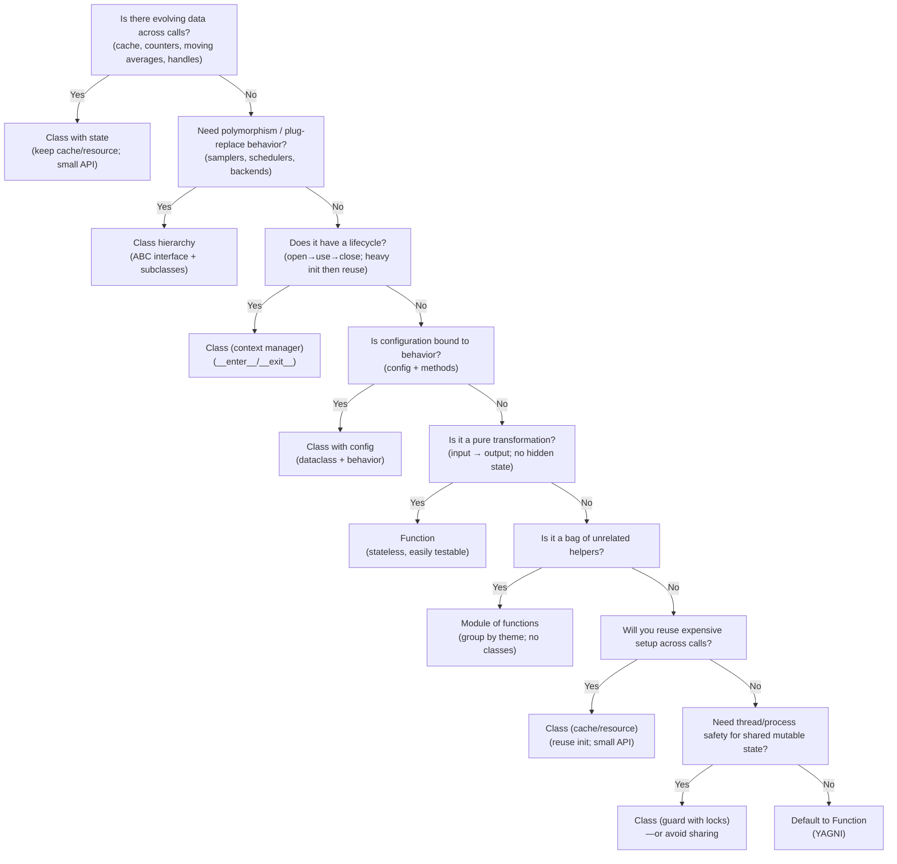

# Class vs Function: When to Use Which

This note distills a practical decision guide for choosing between classes and functions in Python, aligned with SOLID principles (especially Single Responsibility and Interface Segregation).

## Decision Flowchart

## Practical Guidance

- **Use a class with state**: When logic must maintain evolving data (caches, counters) across calls. Keep the public API minimal and cohesive (SRP).
- **Use an interface + subclasses**: When you need swappable behavior (strategy/backends). Program to an interface (ISP, OCP).
- **Use a context-managed class**: When there is a resource lifecycle or heavy initialization to reuse safely.
- **Use a dataclass with behavior**: When configuration and behavior are tightly coupled and passed around together.
- **Use a plain function**: For pure transformations with no hidden state—simple, testable, and composable.
- **Use a module of functions**: When collecting small, related utilities; avoid unnecessary classes (YAGNI).
- **Consider thread safety**: If sharing mutable state across threads/processes, encapsulate with a class and locking—or avoid sharing.

## Examples (see playground)

Refer to `playground/SOLID/01_class_vs_function.py` for runnable examples covering each decision point.

