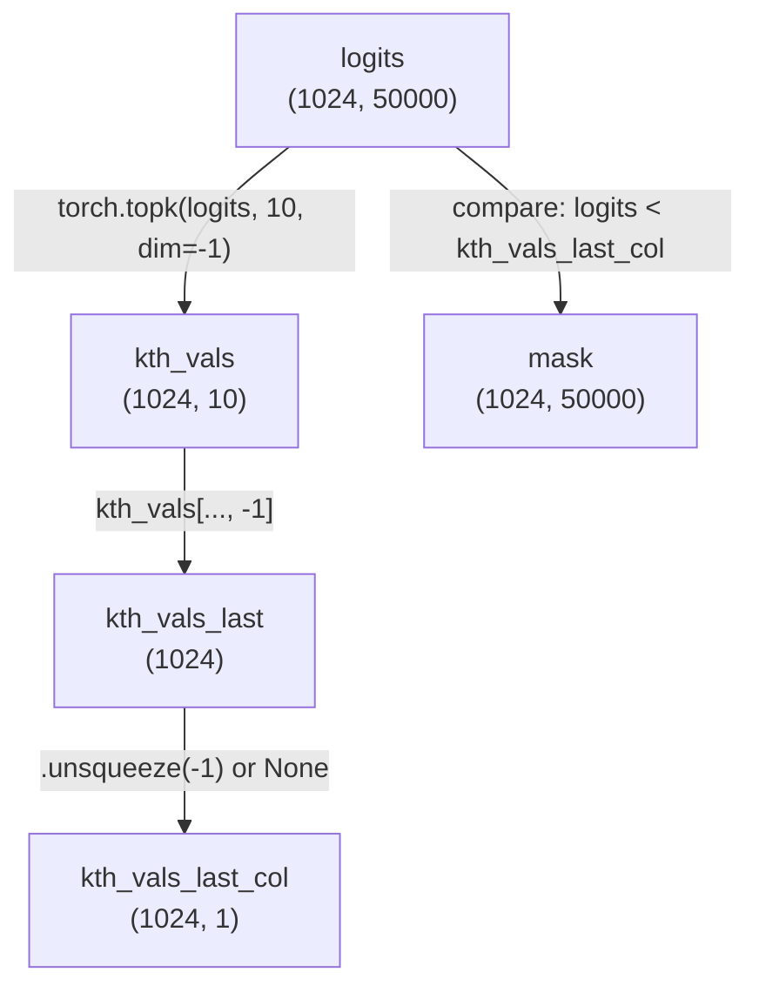

# Understanding Broadcasting with `None` in PyTorch

## Definition
Adding `None` (or using `.unsqueeze()`) to a tensor adds a new axis, changing its shape. This is used to make shapes compatible for broadcasting in PyTorch operations.

## Real-world usage
- Essential in top-k/top-p filtering to compare each logit in a batch to the k-th largest value in that batch.
- Used whenever you need to align tensor shapes for elementwise operations.

## Sample code
```python
import torch

batch_size = 1024
vocab_size = 50000
logits = torch.randn(batch_size, vocab_size)  # shape [1024, 50000]

top_k = 10
kth_vals, _ = torch.topk(logits, top_k, dim=-1)

# this is the last value of each row
kth_vals_last = kth_vals[..., -1]
# this is the last value of each row, but as a column vector
kth_vals_last_col = kth_vals[..., -1, None]

# Broadcasting comparison
mask = logits < kth_vals_last_col
```

## Math dimensions
- **logits:** `[batch_size, vocab_size]` (e.g., `[1024, 50000]`)
- **kth_vals[..., -1]:** `[batch_size]` (e.g., `[1024]`)
- **kth_vals[..., -1, None]:** `[batch_size, 1]` (e.g., `[1024, 1]`)
- **mask:** `[batch_size, vocab_size]` (broadcasted)

## Summary Table
| Shape                | Meaning                        |
|----------------------|-------------------------------|
| `[batch_size, k]`    | Top-k values per batch        |
| `[batch_size]`       | k-th largest value per batch  |
| `[batch_size, 1]`    | k-th largest value, as column |
| `[batch_size, vocab]`| All logits per batch          |

## Why do this?
- Adding `None` makes the shape `[batch_size, 1]` so it can be compared to `[batch_size, vocab_size]` via broadcasting.
- Without this, you’d get a shape mismatch error.

**In short:**
- Use `None` or `.unsqueeze()` to align tensor shapes for broadcasting in PyTorch operations, especially in top-k/top-p filtering.

---

# Broadcasting: The Full Math

## Broadcasting Rules
- **Shapes are aligned from the right (trailing dimensions).**
- For each dimension (from last to first):
  - The sizes must be **equal**, or
  - One of them must be **1** (which will be broadcast to match the other).
- If the number of dimensions differs, the smaller shape is padded on the left with 1s.

## Examples

### Example 1: 2D and 2D
- `[1024, 50000]` and `[1024, 1]` → `[1024, 50000]`
  - 50000 vs 1 → 1 is broadcast to 50000
  - 1024 vs 1024 → match

### Example 2: 2D and 1D
- `[1024, 50000]` and `[50000]` → `[1024, 50000]`
  - `[50000]` is treated as `[1, 50000]`
  - 50000 vs 50000 → match
  - 1024 vs 1 → 1 is broadcast to 1024

### Example 3: 3D and 3D
- `[5, 4, 3]` and `[1, 4, 1]` → `[5, 4, 3]`
  - 3 vs 1 → 1 is broadcast to 3
  - 4 vs 4 → match
  - 5 vs 1 → 1 is broadcast to 5

### Example 4: Incompatible
- `[5, 4, 3]` and `[2, 4, 1]` → **Error**
  - 3 vs 1 → OK
  - 4 vs 4 → OK
  - 5 vs 2 → **Neither is 1, not equal → Error**

### Example 5: Lower-dimensional
- `[5, 4, 3]` and `[3]` → `[5, 4, 3]`
  - `[3]` is treated as `[1, 1, 3]`
  - 3 vs 3 → match
  - 4 vs 1 → 1 is broadcast to 4
  - 5 vs 1 → 1 is broadcast to 5

## Key Points
- **No need for any dimension to match overall**—just follow the rule per dimension.
- If any dimension fails the rule, broadcasting fails.
- Broadcasting is virtual (no extra memory is used unless you call `.expand()` or `.repeat()`).
- Scalars (shape `[]`) can be broadcast to any shape.
- In-place operations (like `+=`) do not allow broadcasting.

## Summary Table
| A shape        | B shape        | Broadcast? | Why?                                 |
|---------------|---------------|------------|--------------------------------------|
| `[N, M]`      | `[N, 1]`      | Yes        | 1 can be broadcast to M              |
| `[N, M]`      | `[1, M]`      | Yes        | 1 can be broadcast to N              |
| `[N, M]`      | `[N, M]`      | Yes        | Shapes are equal                     |
| `[N, M]`      | `[1, 1]`      | Yes        | 1 can be broadcast to N and M        |
| `[N, M]`      | `[K, 1]`      | **No**     | N ≠ K and neither is 1               |
| `[5, 4, 3]`   | `[1, 4, 1]`   | Yes        | 1s broadcast to 5 and 3              |
| `[5, 4, 3]`   | `[2, 4, 1]`   | No         | 5 ≠ 2, neither is 1                  |
| `[5, 4, 3]`   | `[3]`         | Yes        | `[3]` → `[1, 1, 3]`                  |
| `[5, 4, 3]`   | `[1, 1, 3]`   | Yes        | 1s broadcast to 5 and 4              |

---

## Visual Diagram (Mermaid)

